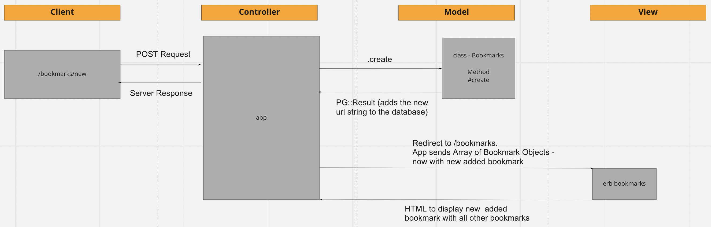

# Bookmark Manager

* Initial Project setup README - this will be updated.

## User Stories - Work In Progress

## Domain Model - Work In Progress
#### Show All Bookmarks

#### Add new Bookmarks

## Database Setup - PostgreSQL
### Development Environment
Run the following from your terminal

1. Connect to psql: `psql`
2. Create a database: `CREATE DATABASE bookmark_manager;`
3. Connect to the database `\c bookmark_manager;`
4. Run the following commands to setup the bookmarks table & columns. In order :
    1. `\i ./db/migrations/01_create_bookmarks_table.sql`
    2. `\i ./db/migrations/02_add_title_column_to_bookmarks_table.sql`

### Test Environment
1. Connect to psql: `psql`
2. Create a database: `CREATE DATABASE bookmark_manager_test;`
3. Connect to the database `\c bookmark_manager_test;`
4. Run the following commands to setup the bookmarks table & columns. In order :
    1. `\i ./db/migrations/01_create_bookmarks_table.sql`
    2. `\i ./db/migrations/02_add_title_column_to_bookmarks_table.sql`
